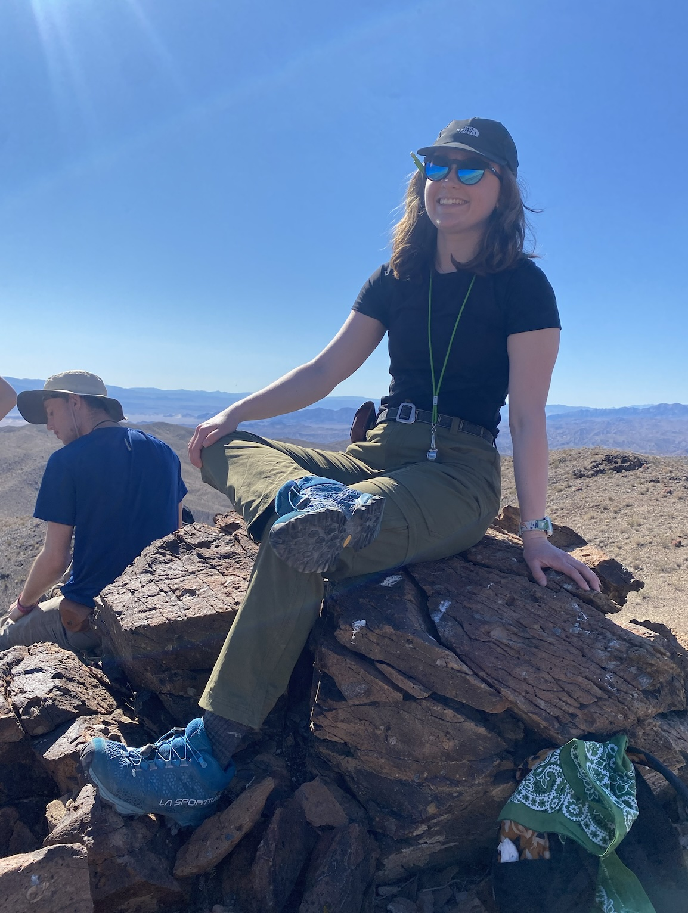
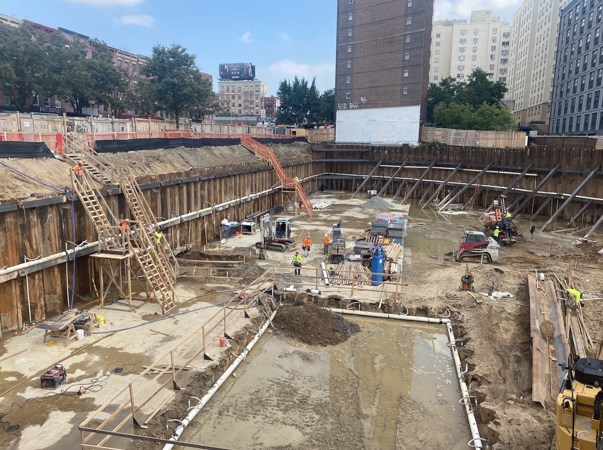
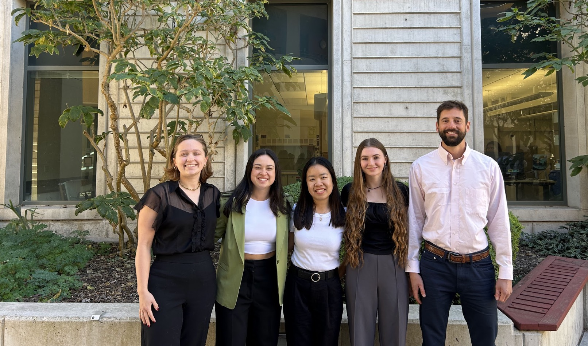
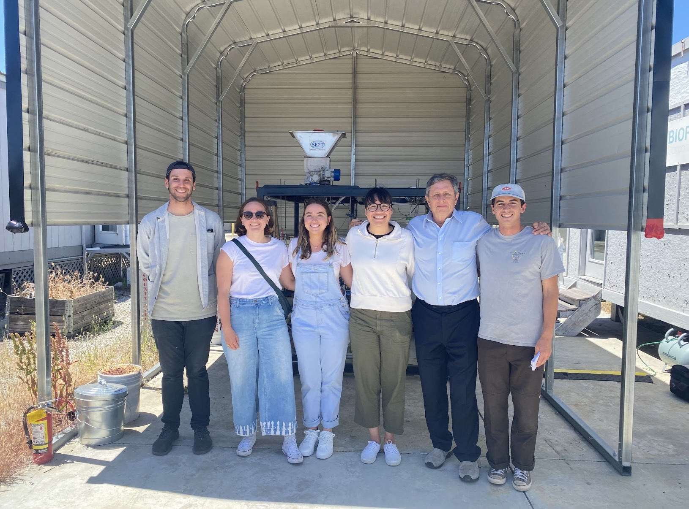
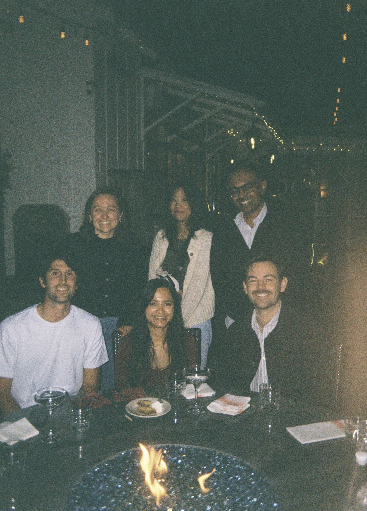

While I originally came into college as an Art History and Chinese double major, my first Earth Science class quickly changed everything. After a few weeks of camping in the rain and being taken into cave rivers, I was hooked, and have been ever since. I graduated in 2018 with my BA in Environmental Earth Science, and moved to NYC to pursue my dream of being a Geologist. 

After a few months of being a consulting Geologist, I realized the career trajectory of a consultant did not match up with my goals, so I applied to the Bren School at UCSB. While there, I focused on Water Resources Management, and continued to pitch projects relating to rivers, as that was always what captured my interest. In the summer betwen my first and second year, I began working for Vamsi Ganti as a Research Assistant, studying rivers and how and why they change paths (avulse). This led me down a path I never thought I would end up on, which is as a first year PhD student in the Geography Department still at UCSB. 

My current work focuses on California Rivers, as we are trying to understand how different rivers in California migrate, and what factors could be at play. This work is funded by NOAA and FEMA, and will (hopefully) be applied to improve flood mapping and provide insight as to whether salmon habitats line up with areas of high river mobility.

Outside of work, you can find me running slowly around UCSB's campus, lying on the beach covered head to toe in clothing, or biking around downtown. 

::: panel-tabset
## Professional Experience

**PhD Student**, Surface Processes Lab at UCSB (September 2025-Present)

**Research Assistant**, Surface Processes Lab at UCSB (June 2024- September 2025)

**Data Manager**, Group Project at the Bren School at UCSB (March 2024-June 2025)

**Environmental Planning Intern**, Morro Bay Estuary Program (June 2024-September 2024)

## Education

**PhD in Geography**, UCSB (Anticipated 2030)

**MESM in Environmental Science and Management** , The Bren School at UCSB (September 2023-June 2025)

**BA in Environmental Science and Management** , Washington University in St. Louis (August 2018-May 2022)

## Highlighted Coursework

**Technical Coursework**
Advanced Data Analysis (R) \| Geographic Information Systems (GIS) \| Data Visualization (R)

**Water Coursework**
Quantitative Geomorphology \| Groundwater Management \| Sustainable Water Resource Management

## Photos

::: {.cell layout-ncol=2}
{width=30%, fig-align="center"}

{width=30%, fig-align="center"}

{width=30%, fig-align="center"}

{width=30%, fig-align="center"}

{width=30%, fig-align="center"}

{width=30%, fig-align="center"}
:::

:::
