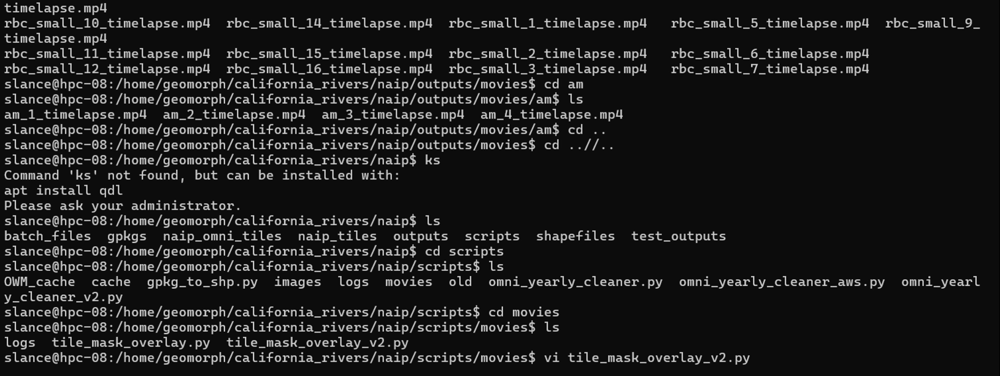

  

# **Introduction**

We all know the feeling, you see the symbol of the terminal in your applications folder and you pray your IT team does not does not ask you to go into that scary black hole. No GUI to help you through, just lines of white text that somehow is your computer's entire system?? And it's different on Mac and Windows, and there's a whole other thing called Linux?? Even worse, what is a SLURM??

But as a recent convert, I am here to spread the good word. It may be old fashioned, but it both tools are incredibly powerful, and can be a great way to learn how your computer works. It is also a great way to learn how to use Python, which is a powerful programming language that is widely used in many fields, including geology.

#**The Guide**

As I have been on my own learning journey, I have been compiling a guide to help beginners to be able to work in the command line independently to run some pretty big jobs! I was lucky enough to have some pretty brilliant people by my side helping me to learn some basic commands and answer some pretty asinine questions, but most people are not so lucky. This is a collection of knowledge I have gained, hopefully written in a way that is accessible to beginner researchers. 

If you do find this guide helpful, please let me know! This is in a Google Docs format, so leave any comments or suggestions you have, and I will be sure to update the guide as I learn more about the command line myself!

